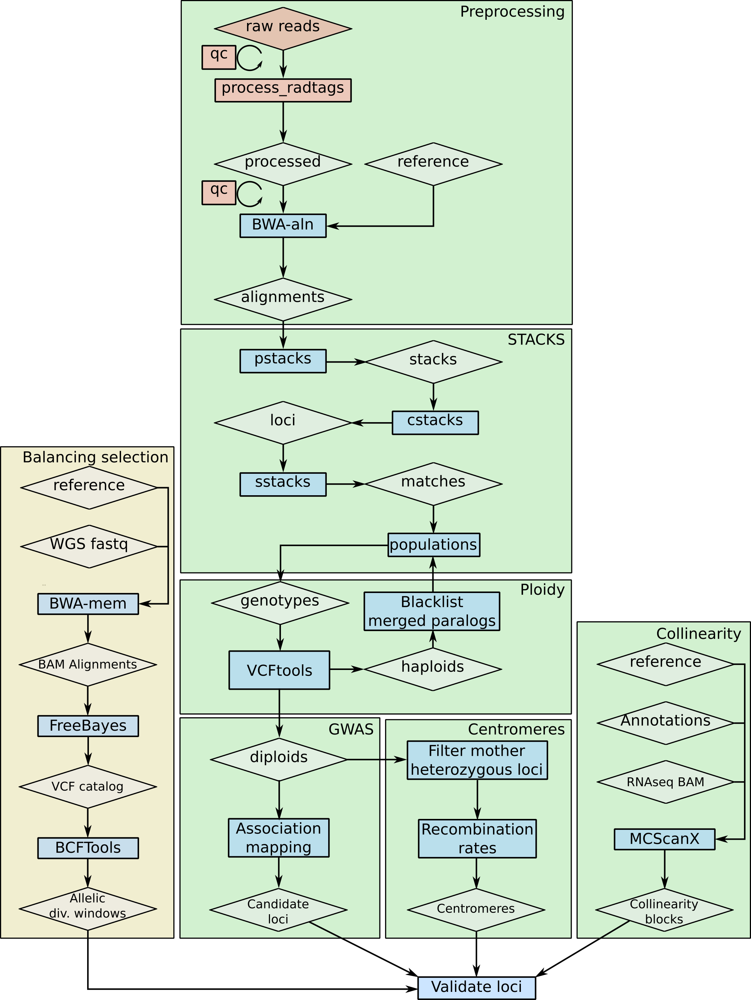

# Genetic basis of sex determination in a parasitoid wasp species
Master project for the Molecular Life Sciences master in Bioinformatics, University of Lausanne

### Cyril Matthey-Doret
### Supervisor: Casper Van der Kooi
### Director: Tanja Schwander
---
In this project, we use restriction-site associated DNA-sequencing (RAD-seq) and build a custom pipeline to locate and identify the complementary sex determination (CSD) locus/loci in the parasitoid wasp species _Lysiphlebus fabarum_. This repository contains a pipeline to map the reads using BWA and build loci using the different components of STACKS with optimal parameters. It was designed to run on a distributed High Performance Computing (HPC) environment with Platform load Sharing Facility (LSF).

To run the pipeline:
1. Place a copy of this repository on a cluster which supports LSF commands.
2. Replace paths accordingly in ```config.mk```
3. Download the `data` archive (not available yet) into the main folder
4. ```cd``` to the main folder
5. Untar the data using ```tar -xzvf data.tar.gz data```
6. Type ```make``` to run the pipeline

### Status:

 __DONE:__ Quality control and Processing of RAD-seq data

 __DONE:__ Transformation of data into catalogue of loci

 __DONE:__ Measuring heterozygosity levels and other statistics per individual and per loci

 __DONE:__ Excluding haploid males from the analysis.

 __WIP:__ Perform association mapping to locate candidate region(s) for CSD

 __TODO:__ Look for annotated genes in candidate region(s)

 __TODO:__ Look for homologies to identify potential paralogs and orthologs

### Dependencies:
* [FastQC 0.11.5](https://www.bioinformatics.babraham.ac.uk/projects/fastqc/): Quality control of sequencing data.
* [BWA 0.7.2](http://bio-bwa.sourceforge.net/): Aligning sequencing reads
* [STACKS 1.30](http://catchenlab.life.illinois.edu/stacks/): RAD-seq data processing
* [SAMtools 1.3](http://samtools.sourceforge.net/): Manipulating SAM files
* [VCFtools 0.1.13](https://vcftools.github.io/): Parsing VCF files
* [R 3.3.x](https://www.r-project.org/)
  + [tidyverse 1.1.1](http://tidyverse.org/): Group of packages for data processing  (includes dplyr, ggplot2,tibble, stringr, magittr and tidyr among others)
* [Python 2.7.x](https://www.python.org/)
  + [numpy 1.11](http://www.numpy.org/): Fast array and vectorized operations
  + [pandas 0.19](http://pandas.pydata.org/): Convenient dataframes
  + [matplotlib 1.5](https://matplotlib.org/): Plotting methods

### Scripts

The `src` folders contains all scripts required to run the analysis along with other programs used for automated report generation and benchmarking. Those scripts are organized into several sub folders:

* `archive`: This folder contains previous versions of scripts and code snippets which may be prove useful again.


* `process_reads`: This folder contains script for demultiplexing, trimming and removing adaptors from raw sequencing reads. These are not implemented in the pipeline.
  + `process_reads`: Template for processing raw reads using the `process_radtags` module from STACKS, which allows to detect restriction sites from RAD-sequencing and perform all common read processing steps.
  + `qc.sh`: small template script for quality control using fastqc.


* `mapping`: This folder contains scripts used to map processed sequencing reads to the reference genome of _Lysiphlebus fabarum_.
  + `bwa_script.sh`: Coordinates the mapping of all samples using BWA, sending the output to `split_sam.pl`.
  + `parse_summaries.sh`: Produces a condensed summary table of reads mapped to the reference genome by parsing the log files from `split_sam.pl` produced with different mapping parameters.
  + `split_sam.pl`: Parses the output sam files to split single hits and multiple hits into separate files and convert the files into bam format.


* `misc`: This folder contains various scripts that are not required for the main pipeline, but are needed for report generation, benchmarking and exploring the parameter space to optimize the pipeline.
  + `map_param.py`: Generates a line plot to visualize the mapping statistics produced by `parse_summaries.sh` in the report.
  + `parse_pstacks.sh`: Parses the log files obtained by pstacks with different parameter values to produce a table of summary statistics for the report.
  + `parse_cstacks.sh`: Parses the cstacks output catalogue to compute summary statistics and store them in a table for the report.
  + `parse_VCF.sh`: Uses vcftools to compute several statistics from the output VCF file returned by the populations module of STACKS and store them in text files inside the `vcftools` subfolder.
  + `plot_VCF.R`: Produces barplots to visualize the output statistics extracted by `parse_VCF.sh`: Plots are stored in the `vcftools` subfolder and used in the report.
  + `assembly_stats.R`: Generates a table with standard descriptive statistics of the assembly (N50, number of contigs...).
  + `explo_assoc.py`: Uses genotype matrices of each family to measure proportion of heterozygosity across individuals of each SNPs, and producing visualizations. Also produces a list of SNPs that are homozygous in mothers and another list of "potential CSD candidates".
  + `SNP_stats.R`: Summarises lists of SNPs into number of SNPs per family for producing tables in lab book.


* `stacks_pipeline`: This folder contains scripts required to run the different components of the STACKS suite
  + `multi_pstacks.sh`: Generates one temporary script per sample, running each of these in parallel. Each script produces 'stacks' from processed reads, using the Pstacks module.
  + `sub_cstacks.sh`: Constructs a catalogue of loci from `multi_pstacks.sh` output files. Only files containing at least 10% of the mean number of RAD-tags (computed over all files) are included in the catalogue to remove poor quality samples.
  + `group_sstacks.sh`: Copy pstacks and cstacks output files to the sample folder to provide a working directory for `multi_sstacks.sh`.
  + `multi_sstacks.sh`: Generates one temporary script per sample, running each of these in parallel. Each script produces a 'match' file from pstacks and cstacks output files (stacks and catalogue, respectively).
  + `pop_FST.sh`: Uses the populations module to compute Fst and other statistics from sstacks output files.


* `ploidy`: This folder contains scripts required to classify males as diploid or haploid based on the genomic data.
  + `haplo_males.py`: Uses the inbreeding coefficient of daughters in each family to compute a homozygosity threshold in each family and males above this threshold are considered haploid. The implementation is flexible and allows to change the threshold formula easily. A table is then returned with the inferred ploidy of each individual.
  + `comp_thresh.R`: Plots the ploidy inferred by different threshold, using tables produces by `haplo_males.py`. Allows to visually selevt the most realistic threshold formula.
  + `prop_offspring.R`: Produces pie charts showing proportion of haploid males, diploid males and daughters for each family.


* `assoc_mapping`: This folder contains scripts used to locate candidate CSD region(s).
  + `genome_Fst.R`: Computes Male-Female Fst at each locus and plots it. Does not take relative positions of SNPs into account, this is just an exploratory analysis.
  + `assoc_map.R`: Performs the actual association mapping, incorporating linkage map information. (WIP)
  + `vcf2ped.sh`: transforms vcf files into ped files, compatible with GenABEL for association mapping.


### Data files

Once the `data.tar.gz` has been uncompressed, the data folder should contain the following files:

* `processed`: This folder contains the processed RAD-tags generated for each sample using process_radtags.
* `ref_genome`: This folder contains only the reference genome.
* `individuals`: Detailed characteristic of each individuals: Name, Sex, Family and Generation where F4 are son/daughter and F3 is the mother.
* `popmap`: Population map required by STACKS to match sample names to population group (i.e. male and female).

After the pipeline has been running, all intermediary and final output files will be generated and stored in their respective sub-folders inside `data`.

### Flowchart

Here is a visual summary of how the pipeline works. Rectangles represent operations/programs, diamonds represent data. Unlike blue ones, red rectangles are not implemented here. This is still WIP.


