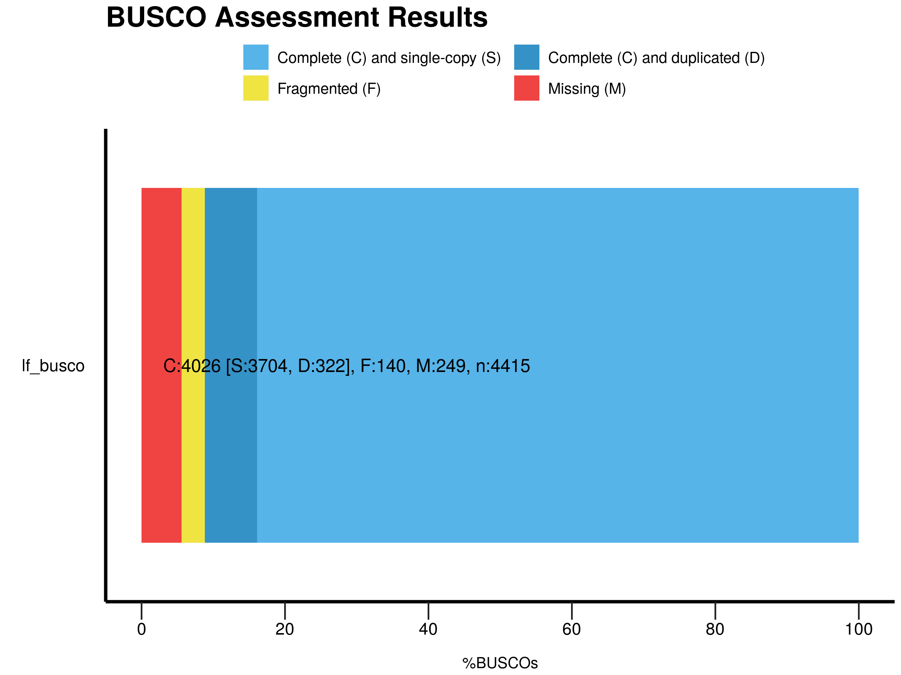

```{r load, echo=F, include=F}
packs <- c("dplyr", "ggplot2", "viridis", "stringr", 
           "scatterplot3d", "rgl", "FactoMineR", "factoextra", 
           "gridExtra", "tibble", "corrplot")
sapply(packs, require, character.only=T)
setwd("~/Documents/UNIL/Master/master_project/")
# QC-related files
qc_folder <- "data/wgs_wild/qc_output/multiqc_data_2/"
sam_adv <- read.table(paste0(qc_folder, "multiqc_samtools_stats.txt"), header=T, stringsAsFactors = F)
fastqc_adv <- read.table(paste0(qc_folder, "multiqc_fastqc.txt"), header=T, fill = T, sep="\t", stringsAsFactors = F)
sam_adv$Sample <- str_replace(sam_adv$Sample, "_stat", "")

gen <- read.table(paste0(qc_folder, "multiqc_general_stats.txt"), header=T, fill = T, sep="\t", stringsAsFactors = F)
sam <- gen %>%
  filter(grepl("_stat", Sample)) %>%
  select(Sample, contains("Samtools")) %>%
  rename_all(
      funs(
        str_replace_all(., "Samtools.Stats_", "") %>%
        str_replace_all(., '\\.1', '')
      )
  ) %>%
  mutate(Sample = str_replace(Sample, "_stat", ""))

fastqc <- gen %>%
  filter(!grepl("_stat", Sample)) %>%
  select(Sample, contains("FastQC")) %>%
  rename_all(
      funs(
        str_replace_all(., "FastQC_", "") %>%
        str_replace_all(., '\\.1', '')
      )
  )

# WGS/RAD SNPs
## PI nucleotidic diversity from WGS samples at RAD sites.
wgs_pi <- read.table("data/wgs_wild/RAD_sites/rad2wgs_pi.vcf.sites.pi", header=T)
# RAD association mapping data
rad_snps <- read.table("data/assoc_mapping/case_control/case_control_all.tsv", header=T)
colnames(wgs_pi)[1:2] <- c("Chr","BP")
```

```{r process, echo=F}

# Clear useless variables out of mapping QC data
clean_qc <- sam %>% 
  inner_join(fastqc, by = "Sample") %>%
  select_if(is.numeric) %>%
  select_if(function(x) sd(x, na.rm=T) > 0) %>%
  select(-reads_mapped, -raw_total_sequences) %>%
  mutate_all(function(x) (x - mean(x, na.rm=T)) / sd(x, na.rm=T)) %>%
  rename_all(
      funs(
        str_replace_all(., "percent(age)?", "%") %>%
        str_replace_all(., 'reads', '')
      )
  )

# Clean sample names
clean_names <- str_extract(sam$Sample, "[^_]*")
rownames(clean_qc) <- clean_names
# Merge SNP tables from WGS PI and RAD results
snps <- merge(x = wgs_pi, 
              y = rad_snps, 
              by = c("Chr", "BP"), 
              all = F)

```

# Summary

## DONE

* Properly assessed genome completeness using Hymenoptera as db and nasonia as calibration species (Figure \ref{fig:busco}).
* Excluding sample 196 due to poor overall QC stats
    + visual inspection revealed poor genome coverage and high duplication rates.
    + PCA using (some) QC parameters highlights 196 as an outlier. Mostly because of the duplicates (Figure \ref{fig:QC_PCA}).
    + Sample 196 also has a higher proportion of pairs mapping to different chromosomes. Unsure of biological significance: unanchored contigs considered as chromosomes as well...
    + Several parameters are covariates of PCR duplicates (Figure \ref{fig:QC_heat})
* Assembled genome from PE Illumina from single haploid male
    + Bad assembly, any use ?
* Mapping stats: mem yields good %age of reads because of local alignment methods
    + eport reads mapping to 2 regions (duplicate)
* PI computed from WGS data for all RADseq SNPs (Figure \ref{fig:PI_vs_pval} and \ref{fig:PI_vs_pval_chrom}).
    + Only 1 peak shows reasonable PI and low p-value (Figure \ref{fig:manhattan_PI})
    + Note: Out of the 719 positions from the association mapping, only 501 can be used in WGS data. (Figure \ref{fig:manhattan_PI})

## In progress

## TODO

## Optional

* Polish assembly with Illumina reads (?)
* eventually look at cross-chromosome mapping reads (anchored + non-anchored)

# Figures

```{r BUSCO, echo=F, fig.cap="\\label{fig:busco}Visual summary of BUSCO results for the *L. fabarum* anchored assembly. Orthologs from Hymenotpera were used and Augustus parameters were calibrated using *Nasonia vitripennis*. Exact proportions are: C:91.2%[S:83.9%,D:7.3%],F:3.2%,M:5.6%,n:4415. "}


```


```{r QC_PCA, echo=F, fig.cap="\\label{fig:QC_PCA}Principal component analysis on QC parameters from fastQC and samtools."}
res.pca <- PCA(clean_qc, graph = FALSE, scale.unit = F)

# Percentage of variance explained by each PC
scree <- fviz_screeplot(res.pca, ncp=10)

# Contribution of each variable to the PCs
contrib <- fviz_pca_var(res.pca, col.var="contrib",axes =c(1,2), repel = T, labelsize=3) +
  scale_color_gradient2(low="white", mid="blue", 
                        high="red", midpoint=.5) + theme_minimal() + guides(color=F)
# Variable contribution per PC
#fviz_pca_contrib(res.pca, choice = "var", axes = 1)
#fviz_pca_contrib(res.pca, choice = "var", axes = 2)
#fviz_pca_contrib(res.pca, choice = "var", axes = 3)

# Samples on 2 first PCs
pca_ind <- fviz_pca_ind(res.pca,axes=c(1,2),geom="point") + geom_text(label=clean_names, nudge_y = 0.2, size=1.4)

grid.arrange(grobs=list(scree, contrib, pca_ind), 
             layout_matrix=rbind(c(1,1,2,2), 
                                 c(1,1,2,2), 
                                 c(3,3,2,2),
                                 c(3,3,2,2)))

```

```{r QC_heat, echo=F, fig.width=4, fig.cap="\\label{fig:QC_heat}Pairwise correlation QC parameters. Tile color indicate correlation."}
cor_ind <- cor(t(clean_qc))
cor_var <- cor(clean_qc)

col2 <- colorRampPalette(c("#67001F", "#B2182B", "#D6604D", "#F4A582",
                           "#FDDBC7", "#FFFFFF", "#D1E5F0", "#92C5DE",
                           "#4393C3", "#2166AC", "#053061"))
#heatmap(cor_ind, symm = T, labRow = clean_names, labCol = clean_names, col=col2(200))


#corrplot(cor_ind, method="color",type = "upper",diag = F)
corrplot(cor_var, method="color", type = "upper", diag=F,main="non-standardized")

```


```{r PIvspval, echo=F, fig.cap="\\label{fig:PI_vs_pval}Distribution of the BH-corrected pvalues from the association mapping for CSD versus the PI nucleotidic diversity computed from WGS data on wild samples. Each data point is a genomic position representing a SNP obtained by RADseq."}
PIvspval <- ggplot(data=snps, aes(x=fisher, y=PI)) +
  geom_point() + 
  theme_bw() +
  xlab("-log10 p-value") + 
  ylab("PI diversity")

ggExtra::ggMarginal(PIvspval, type="histogram")

```

```{r PIvspval_per_chr, echo=F, fig.cap="\\label{fig:PI_vs_pval_chrom} Same as figure \\ref{fig:PI_vs_pval}, but each plot shows one chromosome."}
ggplot(data=snps, aes(x=fisher, y=PI)) +
  facet_wrap(~Chr) +
  geom_point() + 
  theme_bw() +
  xlab("-log10 p-value") + 
  ylab("PI diversity")

```

```{r manhattanPI, echo=F, fig.cap="\\label{fig:manhattan_PI}Manhattan plot from the association mapping showing corrected P-values for all anchored SNPs and colored according to nucleotidic diversity from WGS data on wild samples. Red points are missing from WGS data."}
ggplot(snps, aes(x=BP/1000000, y=fisher, col=PI)) + 
  geom_point(data=rad_snps, aes(x=BP/1000000, y=fisher), col="red", inherit.aes = F)+
  geom_point() +
  facet_wrap(~Chr) +
  viridis::scale_color_viridis()
```